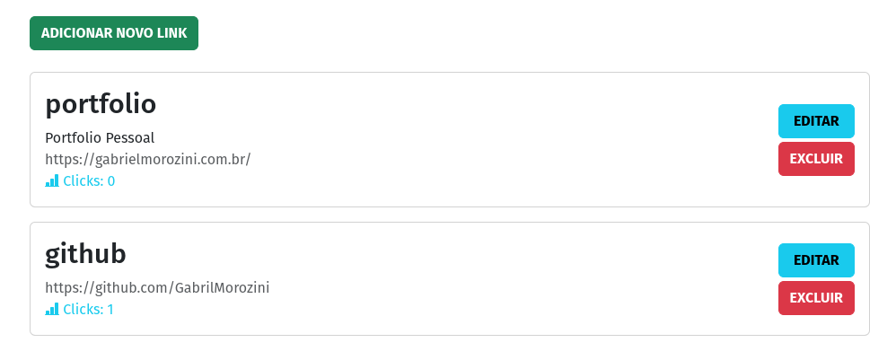
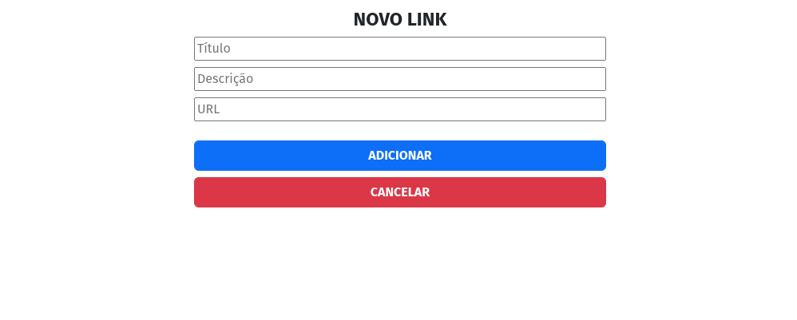
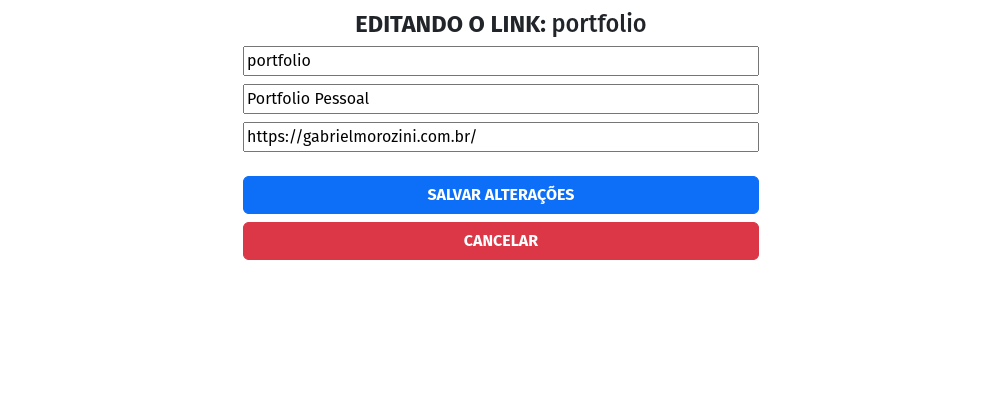

##  Listagem de links

| Adicionando novos links  | Editando links  |
|:-------------:|:------------:|
| |  |

## 📚 Sobre o projeto 
 
Desenvolvi um redirecionador de páginas como parte do meu treinamento em banco de dados MongoDB durante o curso PROGRAMADOR BR. Este projeto permite armazenar e administrar cards contendo informações essenciais, como título, descrição e URL. Ao acessar o seu domínio, é possível redirecionar para a URL associada ao título pesquisado na barra de endereço.

Na implementação desse projeto, utilizei o banco de dados MongoDB, a biblioteca mongoose ODM, além do framework Express.js e o EJS (template engine) que facilitou a criação de interfaces dinâmicas e interativas.

A funcionalidade principal do redirecionador abrange a capacidade de salvar, editar, excluir cards e proporcionar um redirecionamento eficiente para a URL desejada.

 

## 🖥️ Tecnologias utilizadas

* HTML
* JavaScript
* BootStrap
* NodeJS
* MongoDB
* Mongoose
* EJS

 

  
  
       

